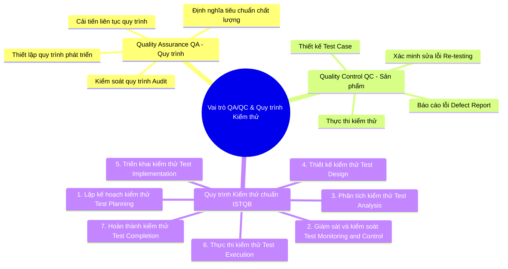

# SƠ ĐỒ TƯ DUY VAI TRÒ QA/QC & QUY TRÌNH KIỂM THỬ ISTQB

Tài liệu này thực hiện yêu cầu kiểm tra kỹ năng **G9.1 (Understand)**: Yêu cầu AI vẽ sơ đồ tư duy về vai trò QA/QC và quy trình kiểm thử, từ đó phát hiện và chỉnh sửa 3 sai sót cốt lõi của AI dựa trên kiến thức chuẩn ISTQB.

---

## 1. Sơ đồ tư duy vai trò QA/QC và Quy trình Kiểm thử (Dạng Mermaid)

Dưới đây là sơ đồ tư duy đã được hiệu chỉnh chính xác theo chuẩn ISTQB CTFL v4.0:

---

## 2. Phân tích 3 Sai sót cốt lõi của AI và Bản hiệu chỉnh chuẩn ISTQB

Khi yêu cầu các công cụ AI (Gemini/ChatGPT) phác thảo sơ đồ tư duy ban đầu về vai trò QA/QC và quy trình kiểm thử phần mềm, mô hình AI thường mắc phải 3 sai sót nghiêm trọng sau đây:

### Sai sót 1: Nhầm lẫn bản chất giữa Quality Assurance (QA) và Quality Control (QC)

- **Lỗi của AI:** AI thường đặt các công việc như _"Thực thi kiểm thử (test execution)"_ hay _"Tìm lỗi phần mềm (bug hunting)"_ dưới nhánh công việc của **QA**, và đặt _"Xây dựng tiêu chuẩn chất lượng cho quy trình phát triển phần mềm"_ dưới nhánh của **QC**.
- **Giải thích kỹ thuật (Chuẩn ISTQB):** Theo giáo trình chuẩn ISTQB CTFL, **QA (Quality Assurance)** là các hoạt động định hướng quy trình (process-oriented), tập trung vào việc ngăn ngừa lỗi (preventive activities) bằng cách tối ưu hóa quy trình phát triển. Trong khi đó, **QC (Quality Control)** là các hoạt động định hướng sản phẩm (product-oriented), tập trung vào việc phát hiện và sửa lỗi trực tiếp trên sản phẩm (corrective/detective activities) thông qua thiết kế và thực thi kiểm thử.
- **Bản hiệu chỉnh:** Đưa việc thiết kế, chạy test case và báo cáo lỗi về đúng nhánh QC; đưa việc định nghĩa quy trình, kiểm tra chất lượng (audit) và cải tiến quy trình về đúng nhánh QA.

### Sai sót 2: Nhầm lẫn và gộp các giai đoạn trong Quy trình Kiểm thử Chuẩn (ISTQB Test Process)

- **Lỗi của AI:** AI thường gộp chung _"Phân tích kiểm thử (Test Analysis)"_ và _"Thiết kế kiểm thử (Test Design)"_ thành một bước duy nhất, hoặc đặt _"Thực thi kiểm thử (Test Execution)"_ trước giai đoạn _"Triển khai kiểm thử (Test Implementation)"_.
- **Giải thích kỹ thuật (Chuẩn ISTQB):** Theo chương 1 của ISTQB CTFL v4.0, quy trình kiểm thử gồm các giai đoạn riêng biệt với mục tiêu cụ thể:
  1. _Test Analysis_ là để xác định **cái gì cần kiểm thử** (thiết lập test conditions dựa trên test basis).
  2. _Test Design_ là để xác định **kiểm thử như thế nào** (tạo các test cases chi tiết).
  3. _Test Implementation_ là để chuẩn bị môi trường và dữ liệu (tạo test suites, cấu hình môi trường). Giai đoạn này bắt buộc phải diễn ra trước _Test Execution_ (chạy các test cases).
- **Bản hiệu chỉnh:** Tách biệt rõ ràng 7 giai đoạn kiểm thử của ISTQB và sắp xếp theo đúng thứ tự logic tuyến tính của quy trình kiểm thử phần mềm chuyên nghiệp.

### Sai sót 3: Đồng nhất hoạt động Kiểm thử (Testing) và Gỡ lỗi (Debugging)

- **Lỗi của AI:** AI đưa hoạt động _"Gỡ lỗi (Debugging / Fixing bugs)"_ vào sơ đồ tư duy như là một công việc thuộc quy trình kiểm thử và do Tester chịu trách nhiệm thực hiện.
- **Giải thích kỹ thuật (Chuẩn ISTQB):** ISTQB CTFL nêu rõ: **Testing** và **Debugging** là hai hoạt động hoàn toàn khác biệt. Kiểm thử (Testing) là việc chạy thử phần mềm để phát hiện lỗi và hành vi bất thường, do Tester thực hiện. Gỡ lỗi (Debugging) là hoạt động phát hiện nguyên nhân gốc của lỗi (root cause), phân tích mã nguồn và sửa mã nguồn để loại bỏ lỗi, do Developer thực hiện.
- **Bản hiệu chỉnh:** Loại bỏ hoàn toàn hoạt động "Fixing bugs/Debugging" ra khỏi nhánh nhiệm vụ của QC/Tester, phân định rõ debugging là hoạt động của nhà phát triển (Developer) phát sinh sau khi nhận được Defect Report từ Tester.
